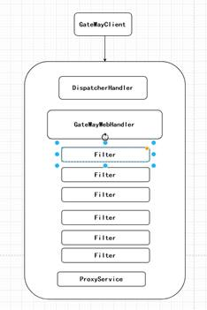

### SpringCloud Gateway

#### 一、什么是微服务网关

微服务网关是整个微服务API请求的入口，可以实现日志拦截、权限控制、解决跨域问题、限流、熔断、负载均衡、黑名单和白名单控制、授权等。

#### 二、过滤器与网关的区别

过滤器用于拦截单个服务，网关拦截整个微服务。

#### 三、Zuul与gateway区别

Zuul网关属于netfix公司开源的产品属于第一代微服务网关

Gateway属于SpringCloud自研发的第二代微服务网关

相比来说SpringCloudGateway性能比Zuul性能要好：

注意：Zuul基于Servlet实现的，阻塞式的Api， 不支持长连接。

SpringCloudGateway基于Spring5构建，能够实现响应式非阻塞式的Api，支持长连接，能够更好的整合Spring体系的产品。

Zuul网关依赖Spring-boot-web组件，Gateway依赖 WbFlux。

#### 四、 Gateway实现真实服务转发

##### 1.maven依赖

```xml
    <parent>
        <groupId>org.springframework.boot</groupId>
        <artifactId>spring-boot-starter-parent</artifactId>
        <version>2.0.1.RELEASE</version>
    </parent>
<dependencies>
        <dependency>
            <groupId>org.springframework.cloud</groupId>
            <artifactId>spring-cloud-starter-gateway</artifactId>
            <version>2.0.1.RELEASE</version>
        </dependency>
        <dependency>
            <groupId>org.springframework.cloud</groupId>
            <artifactId>spring-cloud-starter-alibaba-nacos-discovery</artifactId>
            <version>0.2.2.RELEASE</version>
        </dependency>
    </dependencies>
```

##### 2.添加yml配置

```yaml
server:
  port: 80
####服务网关名称
spring:
  application:
    name: wmh-gateway
  cloud:
    gateway:
      discovery:
        locator:
          ####开启以服务id去注册中心上获取转发地址
          enabled: true
        ###路由策略
      routes:
        ###路由id
        - id: wmh-member
          #### 基于lb负载均衡形式转发
          uri: lb://wmh-member
          filters:
            - StripPrefix=1
          ###匹配规则
          predicates:
            - Path=/member/**
    nacos:
      discovery:
        server-addr: 127.0.0.1:8848
```

#### 五、自定义TokenFilter实现参数拦截 

实现GlobalFilter接口：

```java
@Component
public class TokenFilter implements GlobalFilter {
    @Override
    public Mono<Void> filter(ServerWebExchange exchange, GatewayFilterChain chain) {
        //获取参数
        String token = exchange.getRequest().getQueryParams().getFirst("token");
        if (StringUtils.isEmpty(token)) {
            ServerHttpResponse response = exchange.getResponse();
            response.setStatusCode(HttpStatus.BAD_REQUEST);
            String msg = "token is null";
            DataBuffer dataBuffer = response.bufferFactory().wrap(msg.getBytes());
            return response.writeWith(Mono.just(dataBuffer));
        }
        return chain.filter(exchange);
    }
}
```

#### 六、动态请求参数网关

> 1.基于数据库形式实现
>
> 2.基于配置中心实现

##### 1.表结构

```sql
CREATE TABLE `mayikt_gateway` (
  `id` int(11) NOT NULL AUTO_INCREMENT,
  `route_id` varchar(11) DEFAULT NULL,
  `route_name` varchar(255) DEFAULT NULL,
  `route_pattern` varchar(255) DEFAULT NULL,
  `route_type` varchar(255) DEFAULT NULL,
  `route_url` varchar(255) DEFAULT NULL,
  PRIMARY KEY (`id`)
) ENGINE=InnoDB AUTO_INCREMENT=2 DEFAULT CHARSET=latin1;
```

##### 2.maven依赖

```xml
    <dependencies>
        <dependency>
            <groupId>org.springframework.cloud</groupId>
            <artifactId>spring-cloud-starter-gateway</artifactId>
            <version>2.0.1.RELEASE</version>
        </dependency>
        <dependency>
            <groupId>org.springframework.cloud</groupId>
            <artifactId>spring-cloud-starter-alibaba-nacos-discovery</artifactId>
            <version>0.2.2.RELEASE</version>
        </dependency>

        <dependency>
            <groupId>com.baomidou</groupId>
            <artifactId>mybatis-plus-boot-starter</artifactId>
            <version>3.2.0</version>
        </dependency>

        <!-- mysql 依赖 -->
        <dependency>
            <groupId>mysql</groupId>
            <artifactId>mysql-connector-java</artifactId>
        </dependency>
        <!-- 阿里巴巴数据源 -->
        <dependency>
            <groupId>com.alibaba</groupId>
            <artifactId>druid</artifactId>
            <version>1.0.14</version>
        </dependency>
    </dependencies>
```

具体代码： [https://github.com/kay-520/Java_Learning/tree/SpringCloudAlibaba/02%20Gateway](https://github.com/kay-520/Java_Learning/tree/SpringCloudAlibaba/02 Gateway) 

#### 七、路由策略

详细参考：

https://cloud.spring.io/spring-cloud-gateway/reference/html/#gatewayfilter-factories

#### 八、源码分析

1.客户端向网关发送Http请求，会到达DispatcherHandler接受请求，匹配到

RoutePredicateHandlerMapping。

2.根据RoutePredicateHandlerMapping匹配到具体的路由策略。

3.FilteringWebHandler获取的路由的GatewayFilter数组，创建 GatewayFilterChain 处理过滤请求

4.执行我们的代理业务逻辑访问。

​           


常用配置类说明：

1. GatewayClassPathWarningAutoConfiguration 检查是否有正确的配置webflux

2. GatewayAutoConfiguration 核心配置类

3. GatewayLoadBalancerClientAutoConfiguration 负载均衡策略处理

4. GatewayRedisAutoConfiguration Redis+lua整合限流

#### 九、GateWay解决跨域的问题

```java
@Component
public class CrossOriginFilter implements GlobalFilter {
    @Override
    public Mono<Void> filter(ServerWebExchange exchange, GatewayFilterChain chain) {
        ServerHttpRequest request = exchange.getRequest();
        ServerHttpResponse response = exchange.getResponse();
        HttpHeaders headers = response.getHeaders();
        headers.add(HttpHeaders.ACCESS_CONTROL_ALLOW_ORIGIN, "*");
        headers.add(HttpHeaders.ACCESS_CONTROL_ALLOW_METHODS, "POST, GET, PUT, OPTIONS, DELETE, PATCH");
        headers.add(HttpHeaders.ACCESS_CONTROL_ALLOW_CREDENTIALS, "true");
        headers.add(HttpHeaders.ACCESS_CONTROL_ALLOW_HEADERS, "*");
        headers.add(HttpHeaders.ACCESS_CONTROL_EXPOSE_HEADERS, "*");
        return chain.filter(exchange);
    }
}
```

